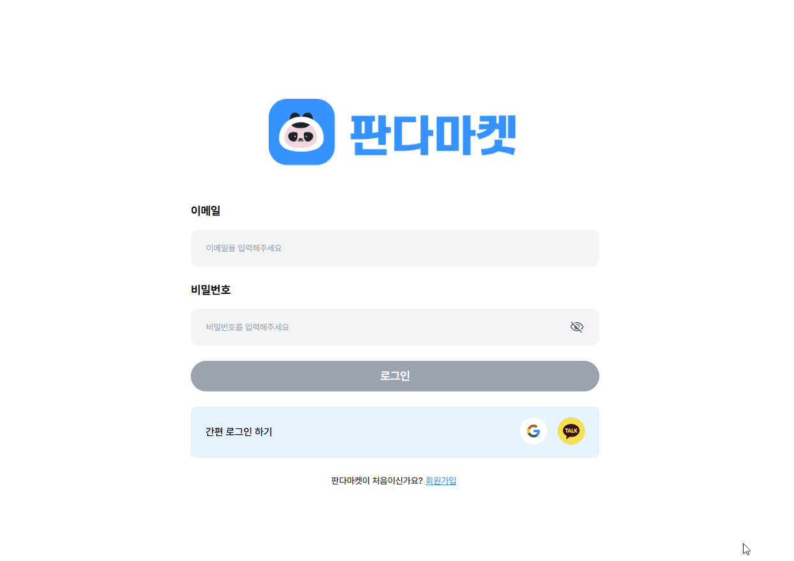
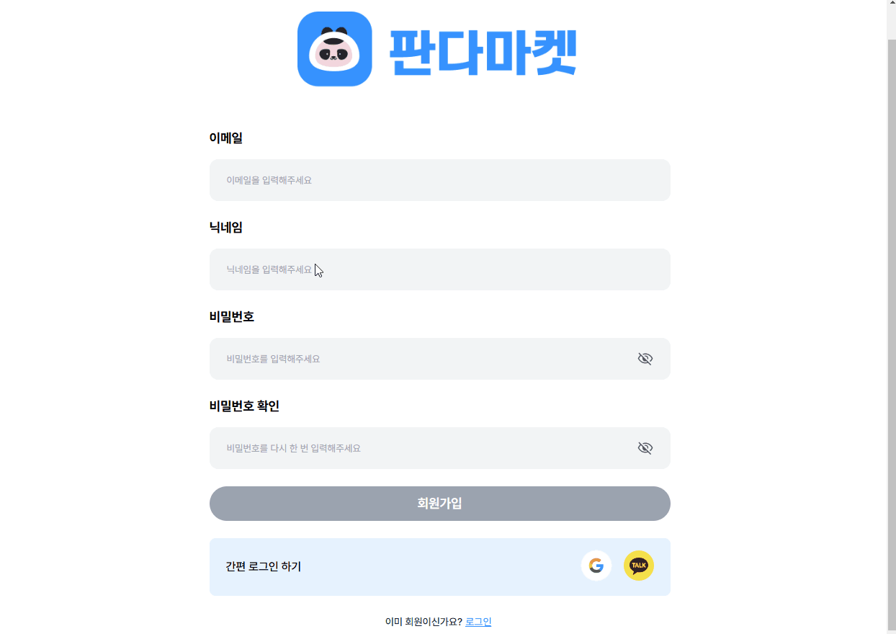

# 03. 스프린트 미션 4

## 요구사항

### 스프린트 미션 4 시안

- [실습 과제 디자인 Figma](https://www.figma.com/design/IVkRlYWHY74QlgmxqA99Ym/%EC%8A%A4%ED%94%84%EB%A6%B0%ED%8A%B8-%EB%AF%B8%EC%85%98?node-id=63-3454)

### 기본 요구사항

- [x] 피그마 디자인에 맞게 페이지 생성 및 UI 라이브러리 미사용
- [x] HTML, CSS 파일을 Netlify로 배포
  - 링크: https://fe-14-sprint-mission-basic-lsj.netlify.app/

### 체크리스트 [기본]

#### 로그인

- [x] 이메일 input에서 focus out 할 때, 값이 없을 경우 input에 빨강색 테두리와 아래에 “이메일을 입력해주세요.” 빨강색 에러 메세지를 보입니다.
- [x] 이메일 input에서 focus out 할 때, 이메일 형식에 맞지 않는 경우 input에 빨강색 테두리와 아래에 “잘못된 이메일 형식입니다” 빨강색 에러 메세지를 보입니다.

- [x] 비밀번호 input에서 focus out 할 때, 값이 없을 경우 아래에 “비밀번호를 입력해주세요.” 에러 메세지를 보입니다
- [x] 비밀번호 input에서 focus out 할 때, 값이 8자 미만일 경우 아래에 “비밀번호를 8자 이상 입력해주세요.” 에러 메세지를 보입니다.

- [x] input 에 빈 값이 있거나 에러 메세지가 있으면  ‘로그인’ 버튼은 비활성화 됩니다.
- [x] Input 에 유효한 값을 입력하면  ‘로그인' 버튼이 활성화 됩니다.
- [x] 활성화된 ‘로그인’ 버튼을 누르면  “/items” 로 이동합니다

#### 회원가입

### 체크리스트 [심화]

- [x] 눈 모양 아이콘 클릭시 비밀번호의 문자열이 보이기도 하고, 가려지기도 합니다.
- [x] 비밀번호의 문자열이 가려질 때는 눈 모양 아이콘에는 사선이 그어져있고, 비밀번호의 문자열이 보일 때는 사선이 없는 눈 모양 아이콘이 보이도록 합니다.

## 주요 변경사항

### 스프린트 미션 3 리뷰 반영
- [login.js](./scripts/login.js), [signup.js](./scripts/signup.js)
  - 변수 지정 및 함수명 변경을 통한 가독성 확보
- [login.html](./login.html), [signup.html](./signup.html)
  - `
` 태그는 문단을 나타낼 때만 사용으로 변경
  - 비밀번호 확인 `<input type="checkbox" />`에서 `<button type="button" />`사용으로 변경
- [login.css](./styles/login.css), [signup.css](./styles/signup.css)
  - `signup.css`의 중복되는 스타일 제거

### 스프린트 미션 4
- [members.js](./scripts/common/members.js) 추가를 통한 공통 함수 분리 

## 스크린샷

### 로그인 
- 에러문구 표시, 비밀번호 입력 보기, 로그인 버튼 활성화, 페이지 이동

### 회원가입 
- 에러문구 표시, 회원가입 버튼 활성화, 페이지 이동

## 멘토에게

- ``과 같이 `type="module"` 속성을 주어야만 `login.js` 파일에서 `/common/members.js` 파일을 불러올 수 있는 것으로 보입니다. 해당 속성을 사용해야만 하는 이유가 궁금합니다.
- 공통함수 [members.js](./scripts/common/members.js)가 코드량이 많다보니, 더 효율적이고 가독성 좋게 바꿀 수 있는 방법이 있을지 궁금합니다.
- [login.js](/scripts/login.js), [signup.js](./scripts/signup.js) 두 파일이 비슷하게 생긴 점, `signup.html`에서 두 스크립트 파일을 불러오는 점에 개선점이 있을지 궁금합니다.