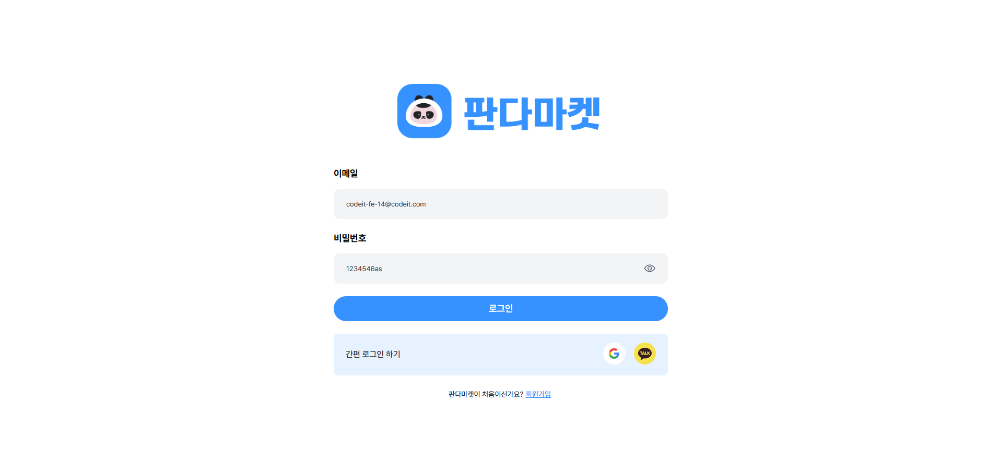

# 01. 스프린트 미션 2

## 요구사항

### 스프린트 미션 2 시안

- [실습 과제 디자인 Figma](https://www.figma.com/design/IVkRlYWHY74QlgmxqA99Ym/%EC%8A%A4%ED%94%84%EB%A6%B0%ED%8A%B8-%EB%AF%B8%EC%85%98?node-id=18-2760&t=A7sb11LEwIRA2krc-1)

### 기본 요구사항

- [x] 피그마 디자인에 맞게 페이지 생성 및 UI 라이브러리 미사용
- [x] HTML, CSS 파일을 Netlify로 배포
  - 링크: https://fe-14-sprint-mission-1-basic-lsj.netlify.app/
- [x] PC사이즈만 고려해 주어진 디자인으로 구현

### 체크리스트 [기본]

- 페이지 이동
  - [x] "판다마켓" 클릭 시 루트 페이지('/')로 이동
  - [x] '로그인' 버튼 클릭 시 로그인 페이지('/login')로 이동
  - [x] SNS 아이콘 클릭 시 각각 실제 서비스 홈페이지로 이동
  - [x] 로그인 페이지 내 [회원가입] 버튼 클릭 시 "/signup" 페이지로 이동
  - [x] 회원가입 페이지 내 [로그인] 버튼 클릭 시 "/login" 페이지로 이동

- 여백
  - [x] 로그인 페이지, 회원가입 페이지 모두 로고 위 상단 여백 동일

- 스타일
  - [x] input 요소 focus in 시 `border-color: #3692FF;` 지정
  - [x] input 요소 focus out 시 `border: none`

### 체크리스트 [심화]

- [x] palette에 있는 color 값을 css 변수로 등록하고 사용
- [x] 비밀번호 input 요소 위에 비밀번호 확인 아이콘 추가

## 주요 변경사항

### 스프린트 미션 1 리뷰 반영
- `<html lang="ko">`으로 수정
- `a`, `button` 중첩 사용 제거
- `h1`은 페이지에 하나만 사용

### 스프린트 미션 2
- [login.html](./login.html)
  - 로그인 폼 추가
  - 로그인 페이지 스타일 생성 ([/styles/login.css](./styles/login.css))
  - script 파일 추가: 로그인 버튼 활성화 및 비밀번호 보기 로직 생성 ([./scripts/login.js](/scripts/login.js))
- [signup.html](./signup.html)
  - 회원가입 폼 추가
  - 회원가입 페이지 스타일 생성: [/styles/signup.css](./styles/signup.css)
  - script 파일 추가: 회원가입 버튼 활성화 및 비밀번호 보기 로직 생성 ([/scripts/signup.js](./scripts/signup.js))

## 스크린샷

### 로그인

### 회원가입

## 멘토에게

- 로그인 페이지를 제작한 후에, html 파일과 css 파일을 복사 붙여넣기 하여 회원가입 페이지를 생성하였습니다.  로그인 페이지와 회원가입 페이지에 중복되는 스타일을 제거 혹은 파일로 합치고 싶은데 어떻게 처리하는 게 가장 효율적이고 좋을까요?

  1) `login.css` , `signup.css` 파일에서 공통되는 스타일을 제거한다. 
  : 예시로 form 그리드, 인풋, 버튼, SNS 로그인 스타일 등 통일되는 스타일을 담은 `form.css` 파일을 제작하여, 
  `login.html` 페이지와 `signup.html` 페이지에서 공동으로 사용하고,  
  각각 추가적인 스타일은 따로 파일을 생성해 추가한다.
  2) `login.html` 페이지와 `signup.html` 페이지가 하나의 css 파일을 함께 사용한다.

- `global.css` 파일에 사용하지 않는 공통 스타일은 제거하는 것이 좋을까요?  아니면 스타일 가이드를 위해 남겨 놓는 것이 좋을까요?