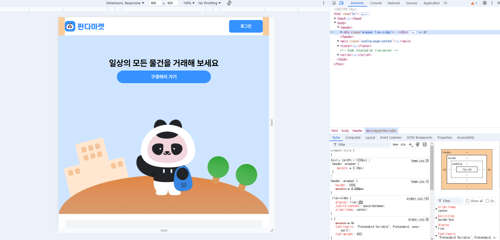
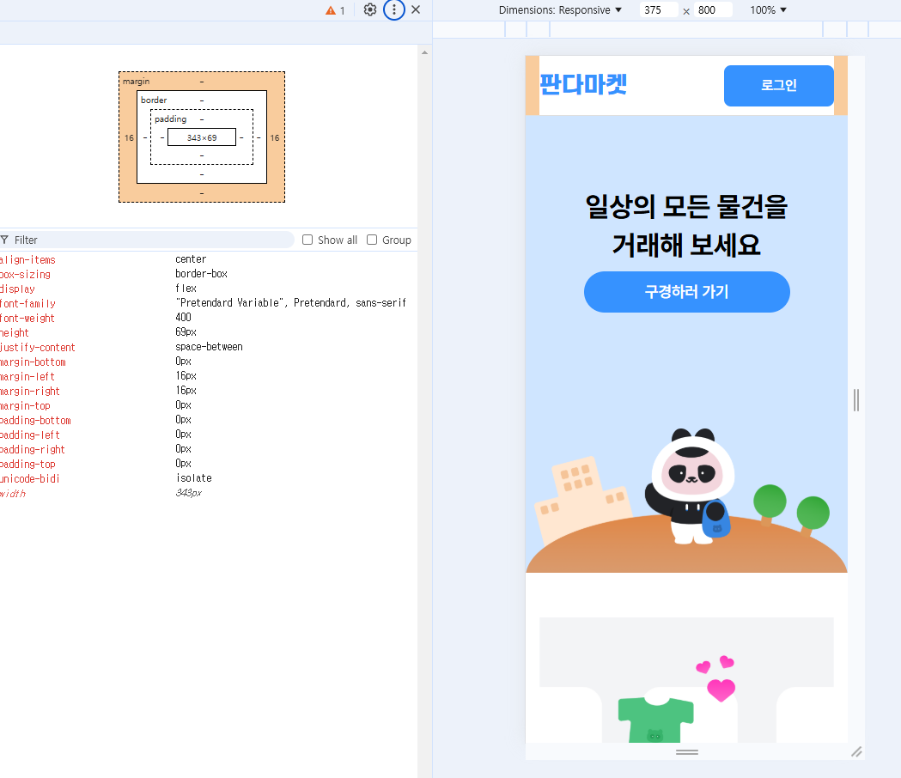
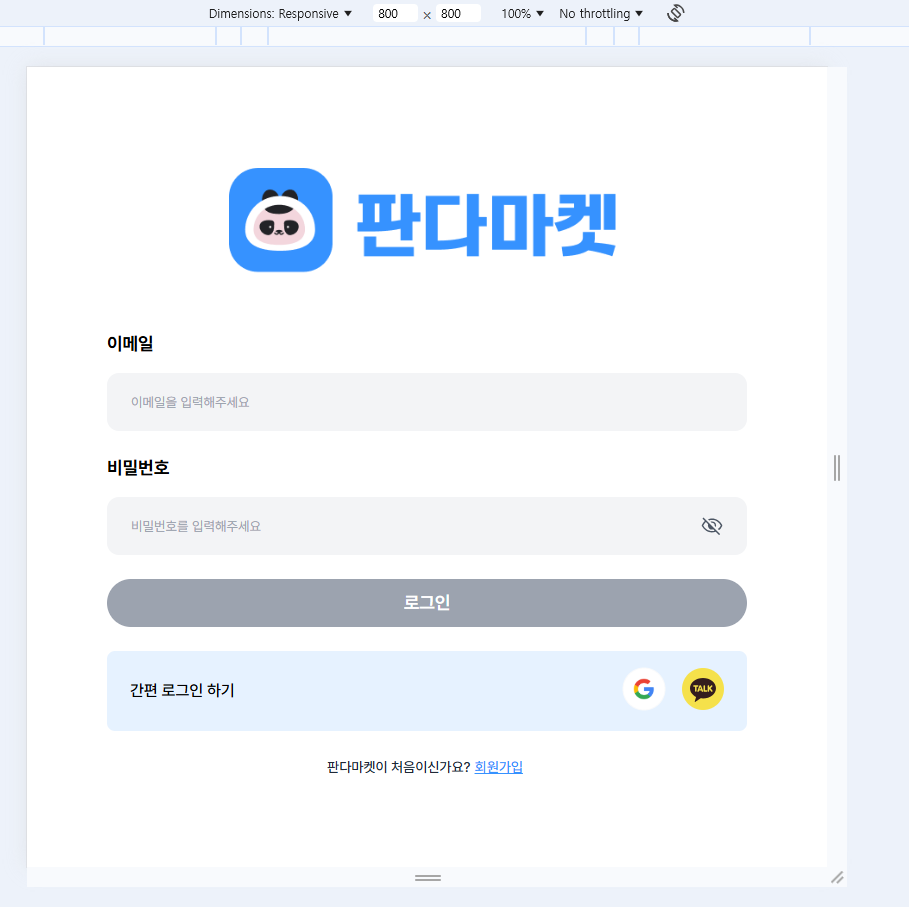
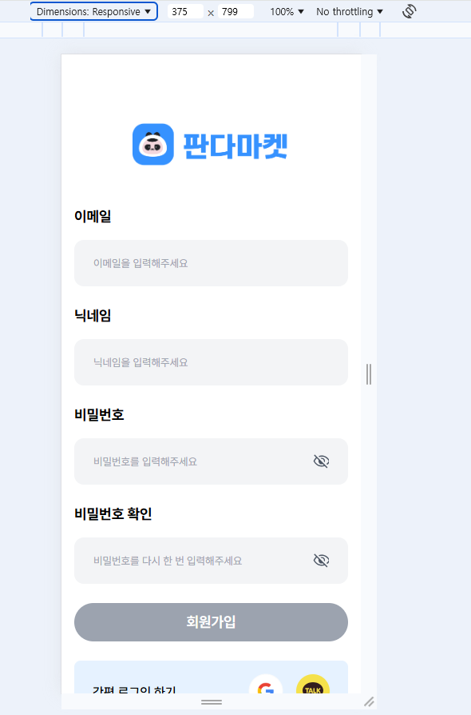

# 03. 스프린트 미션 3

## 요구사항

### 스프린트 미션 3 시안

- [실습 과제 디자인 Figma](https://www.figma.com/design/IVkRlYWHY74QlgmxqA99Ym/%EC%8A%A4%ED%94%84%EB%A6%B0%ED%8A%B8-%EB%AF%B8%EC%85%98?node-id=63-3453)

### 기본 요구사항

- [x] 피그마 디자인에 맞게 페이지 생성 및 UI 라이브러리 미사용
- [x] HTML, CSS 파일을 Netlify로 배포
  - 링크: https://fe-14-sprint-mission-basic-lsj.netlify.app/

### 체크리스트 [기본]

#### 공통
- [x] 브라우저에 현재 보이는 화면의 영역(viewport) 너비를 기준으로 분기되는 반응형 디자인을 적용합니다.
  - PC: 1200px ~
  - Tablet: 768px ~ 1199px
  - Mobile: 375px ~ 767px

#### 랜딩 페이지
- [x] 헤더 좌우 여백 수정
  - Tablet: 24px
  - Mobile: 16px
- [x] 화면 영역이 줄어들면 “Privacy Policy”, “FAQ”, “codeit-2024”이 있는 영역과 SNS 아이콘들이 있는 영역의 간격이 줄어듭니다.

#### 로그인, 회원가입 페이지
- [ ] Tablet: 내부 디자인은 PC사이즈와 동일
- [ ] Mobile: 좌우 여백 16px, 내부 요소들이 너비를 모두 차지
- [ ] Mobile: 내부 요소 `max-width: 400px`

### 체크리스트 [심화]

- [ ] SNS에 랜딩 페이지(“/”) 공유 시 미리보기를 볼 수 있도록 메타 태그 설정
- [ ] 미리보기 제목은 “판다 마켓”, 설명은 “일상의 모든 물건을 거래해보세요”로 설정

## 주요 변경사항

### 스프린트 미션 2 리뷰 반영
- [login.js](./scripts/login.js), [signup.js](./scripts/signup.js)
  - 변수 지정 및 함수명 변경을 통한 가독성 확보
- [login.html](./login.html), [signup.html](./signup.html)
  - `
` 태그는 문단을 나타낼 때만 사용으로 변경
  - 비밀번호 확인 `<input type="checkbox" />`에서 `<button type="button" />`사용으로 변경
- [login.css](./styles/login.css), [signup.css](./styles/signup.css)
  - `signup.css`의 중복되는 스타일 제거

### 스프린트 미션 3
- 

## 스크린샷

### 랜딩 페이지 헤더 - Tablet

### 랜딩 페이지 헤더 - Mobile

### 로그인 - Tablet

### 회원가입 - Mobile

### 랜딩 페이지 공유

## 멘토에게

- 