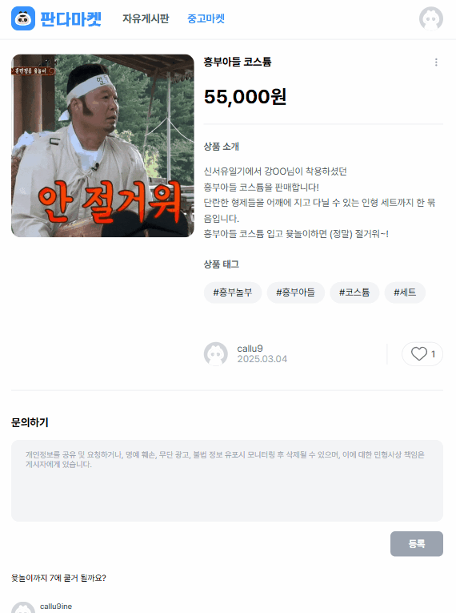
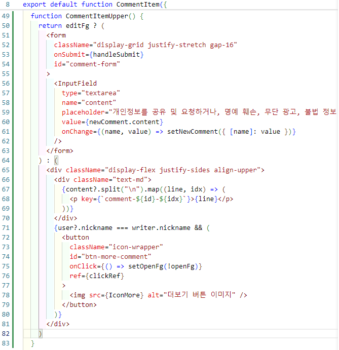
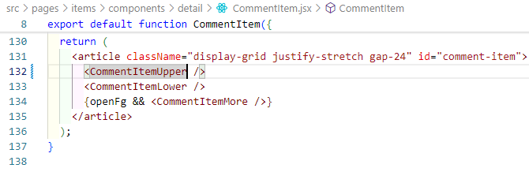
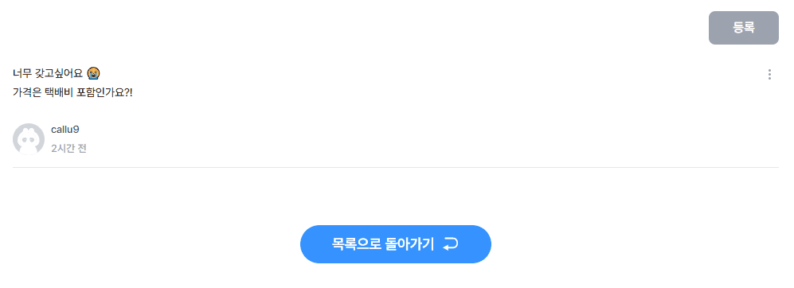

# 스프린트 미션 7

배포 사항: https://fe-14-sprint-mission-react-lsj.netlify.app/

## 기본 요구사항

- [x] Github에 PR(Pull Request)을 만들어서 미션을 제출합니다.
- [x] 피그마 디자인에 맞게 페이지를 만들어 주세요.
- [x] React를 사용합니다

## 체크리스트 [기본]

### 상품 상세

- [x] 상품 상세 페이지 주소는 “/items/{productId}” 입니다.
- [x] response 로 받은 아래의 데이터로 화면을 구현합니다
  - favoriteCount : 하트 개수
  - images : 상품 이미지
  - tags : 상품태그
  - name : 상품 이름
  - description : 상품 설명
- [x] 목록으로 돌아가기 버튼을 클릭하면 중고마켓 페이지 주소인 “/items” 으로 이동합니다

### 문의하기

- [x] 문의하기에 내용을 입력하면 등록 버튼의 색상은 “3692FF”로 변합니다.
- [x] response 로 받은 아래의 데이터로 화면을 구현합니다
  - image : 작성자 이미지
  - nickname : 작성자 닉네임
  - content : 작성자가 남긴 문구
  - description : 상품 설명
  - updatedAt : 문의글 마지막 업데이트 시간

## 체크리스트 [심화]

- [x] 모든 버튼에 자유롭게 Hover 효과를 적용하세요.

## 변경 사항

### 추가 구현 사항

-

## 구현 화면

### 1) Desktop


### 2) Tablet



### 3) Mobile


## 설치 사항

1. Getting Start React Project with Vite

```
npm create vite@latest sprint-mission -- --template react
```

2. Styling with SCSS

```
npm install scss
```

3. send request with axios

```
npm install axios
```

4. compress image file with compressorjs

```
npm install compressorjs
```

## Q&A

- `ItemDetail.jsx` 속 문의하기 영역인 `ItemDetailComments.jsx`에서 `CommentItem.jsx`라는 댓글 요소 컴포넌트를 사용하고 있습니다.<br />이때, 컴포넌트를 더 작게 쪼개고 싶어 `<form id="comment-form"><InputField /></form>`을 function으로 분리해보니, `<InputField />`에 `onChange` 이벤트를 발동시키는 키보드 입력마다 `input` 또는 `textarea`의 포커싱이 아웃되는 현상이 있어 아래 gif 파일처럼 입력이 제대로 되지 않는 현상이 발생했습니다.<br />입력창을 다시 한번 컴포넌트로 분리하는 것을 포기한 상태로 기능이 구현되는 현재와 같이 과제를 완료하였는데요, 아래와 같이 컴포넌트 내부에 함수형 컴포넌트로 분리하면 입력에 어려움이 있는 이유가 궁금합니다.






