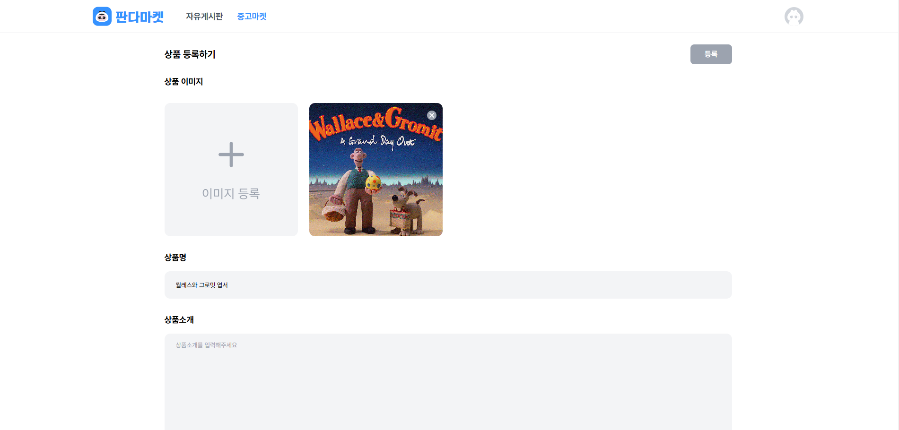
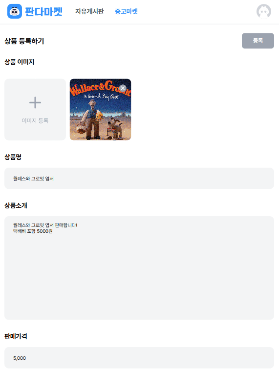
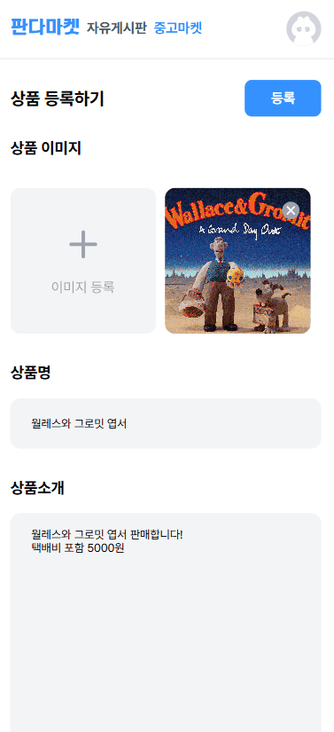
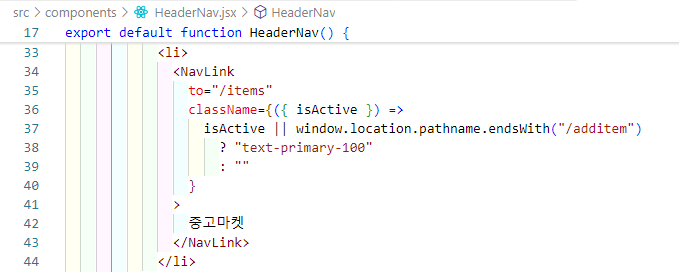

# 스프린트 미션 6

배포 사항: https://fe-14-sprint-mission-react-lsj.netlify.app/

## 기본 요구사항

- [x] Github에 PR(Pull Request)을 만들어서 미션을 제출합니다.
- [x] 피그마 디자인에 맞게 페이지를 만들어 주세요.
- [x] React를 사용합니다

## 체크리스트 [기본]

### 상품 등록상품

- [x] 등록 페이지 주소는 “/additem” 입니다.
- [x] 페이지 주소가 “/additem” 일때 상단네비게이션바의 '중고마켓' 버튼의 색상은 “3692FF”입니다.
- [x] 상품 이미지는 최대 한개 업로드가 가능합니다.
- [x] 각 input의 placeholder 값을 정확히 입력해주세요.
- [x] 이미지를 제외하고 input 에 모든 값을 입력하면 ‘등록' 버튼이 활성화 됩니다.
- [x] API를 통한 상품 등록은 추후 미션에서 적용합니다.

## 체크리스트 [심화]

### 상품 등록

- [x] 이미지 안의 X 버튼을 누르면 이미지가 삭제됩니다.
- [x] 추가된 태그 안의 X 버튼을 누르면 해당 태그는 삭제됩니다.

## 변경 사항

### 추가 구현 사항

- `compressorjs` 사용한 이미지 압축 기능
- 이미지 업로드 기능 구현 (`https://panda-market-api.vercel.app/images/upload` POST api 사용)
- 상품 업로드 기능 구현 (`https://panda-market-api.vercel.app/products` POST api 사용)

## 구현 화면

### 1) Desktop



### 2) Tablet



### 3) Mobile



## 설치 사항

1. Getting Start React Project with Vite

```
npm create vite@latest sprint-mission -- --template react
```

2. Styling with SCSS

```
npm install scss
```

3. send request with axios

```
npm install axios
```

4. compress image file with compressorjs

```
npm install compressorjs
```

## Q&A

- `NavLink` 활용을 유지하려다 보니, `/items`와는 다른 `/additem` 링크 접속 시를 알기 위해 `window.location.pathname`을 사용하여 비교했는데, 더 좋은 방법이 있을까요?

  
